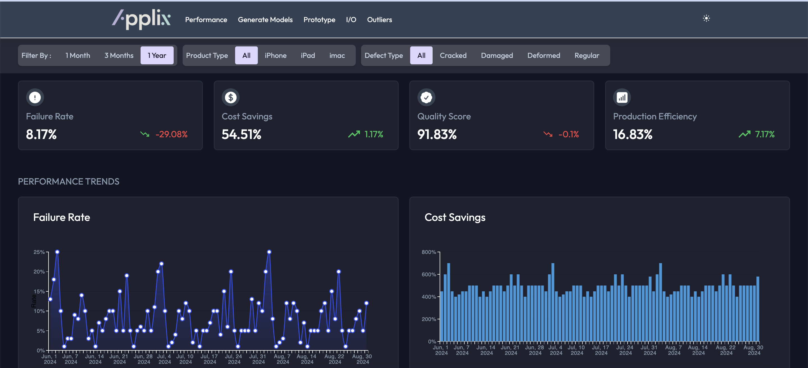
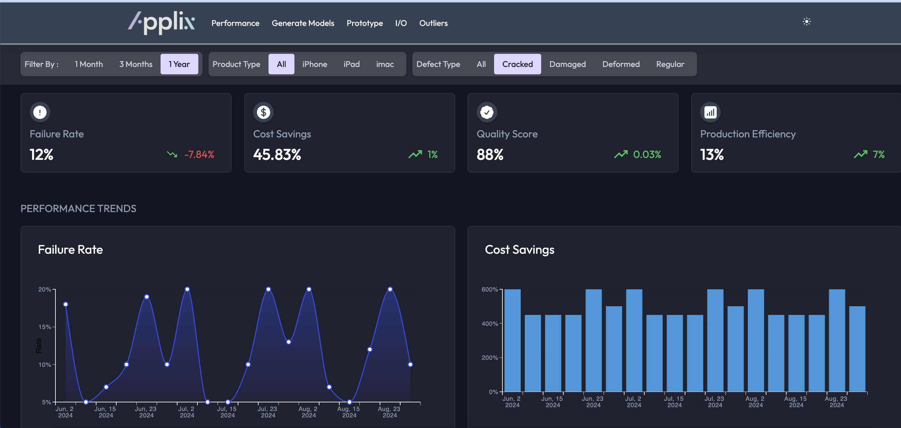
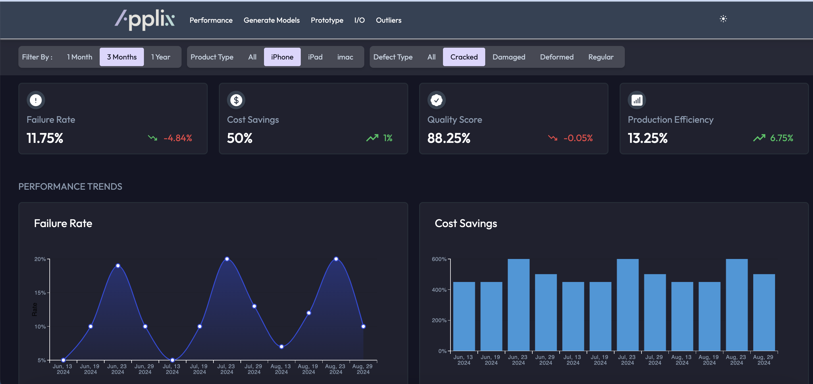
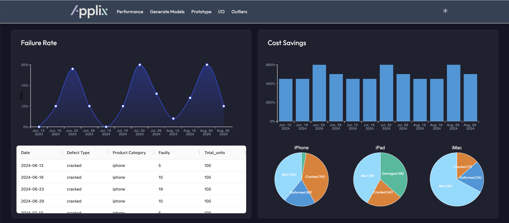
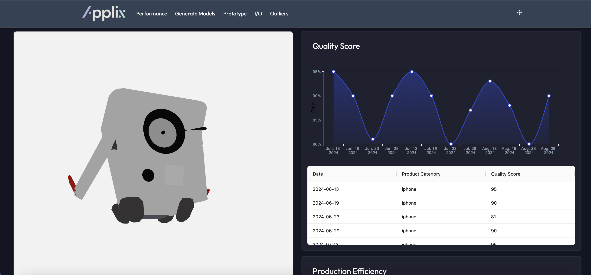
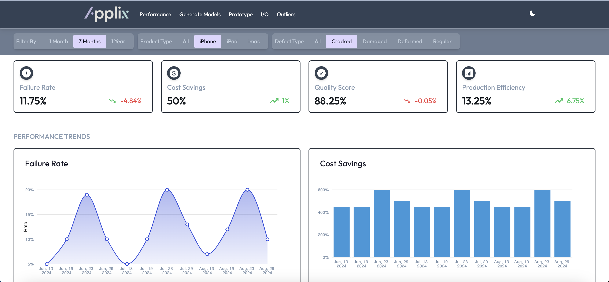

# ApplixAi AutoCopilot

A Next.js web application that features dynamic 3D model rendering with Three.js, interactive data tables using `ag-Grid`, and data visualization with MUI charts.

## Table of Contents

- [Overview](#overview)
- [Features](#features)
- [Installation](#installation)
- [Usage](#usage)
- [Technologies](#technologies)
- [Contributing](#contributing)
- [License](#license)
- [Contact](#contact)

## Overview

This project is a web application built with the Next.js framework, utilizing Three.js for rendering interactive 3D models, `ag-Grid` for displaying data in table format, and Material-UI (MUI) for creating interactive charts. The application aims to provide a comprehensive tool for data visualization and 3D model interaction, including features like rotate, spin, zoom in, and zoom out.

## Features

- **Next.js Framework**: Utilizes server-side rendering and static site generation for performance and SEO benefits.
- **Three.js Integration**: Renders interactive 3D models with support for rotation, spinning, zooming in, and zooming out.
- **`ag-Grid` Data Tables**: High-performance data grids with sorting, filtering, pagination, and editing capabilities.
- **MUI Charts**: Provides interactive and customizable charts for data visualization.
- **Responsive Design**: Optimized for both desktop and mobile devices.
- **Modular Architecture**: Easy to extend, customize, and maintain.

## Live deployed

Please visit - https://applixai-frontend-assignment.vercel.app/
Please follow for mixed content block error - https://stackoverflow.com/a/24434461

## Demo Images -








## Installation

To run this project locally, follow these steps:

1. **Clone the repository:**

   ```bash
   git clone https://github.com/rahulworld/applixai-frontend-assignment.git
   cd applixai-frontend-assignment
   ```

2. **Install dependencies:**

   ```bash
   npm install
   # or
   yarn install
   ```

3. **Run the development server:**

   ```bash
   npm run dev
   # or
   yarn dev
   # or
   pnpm dev
   # or
   bun dev
   ```

4. **Open your browser:**

   Navigate to [http://localhost:3000](http://localhost:3000) to view the application.

## Usage

### 3D Model Rendering with Three.js

The application uses Three.js to render 3D models. You can interact with the models using the following controls:

- **Rotate**: Click and drag the model to rotate
